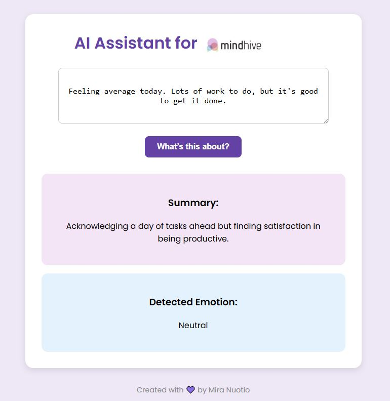
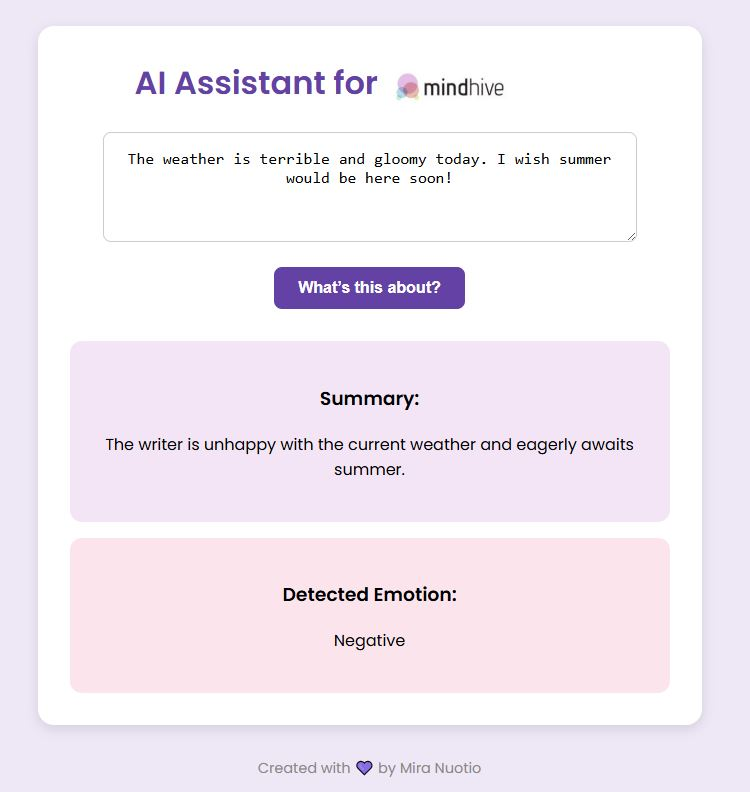

# API AI Demo - message assistant

A simple AI demo made with React, inspired by Mindhive. 

## About the Project

This is a small AI assistant demo that summarizes and analyzes the emotional tone of a message.

I created this to explore React and OpenAI API, and to show my motivation and interest.

It’s inspired by the Mindhive website – including the colors and overall vibe.

## Technologies Used

- React
- OpenAI API
- HTML/CSS (inline styles)
- Git & GitHub

## Demo Preview

## Demo Preview

This project runs locally and showcases how an AI can summarize a message and detect the emotional tone.

## Screenshots

### Positive

### Neutral

### Negative

## Author

Created by **Mira Nuotio**  
Information Technology student  
First time doing something like this

